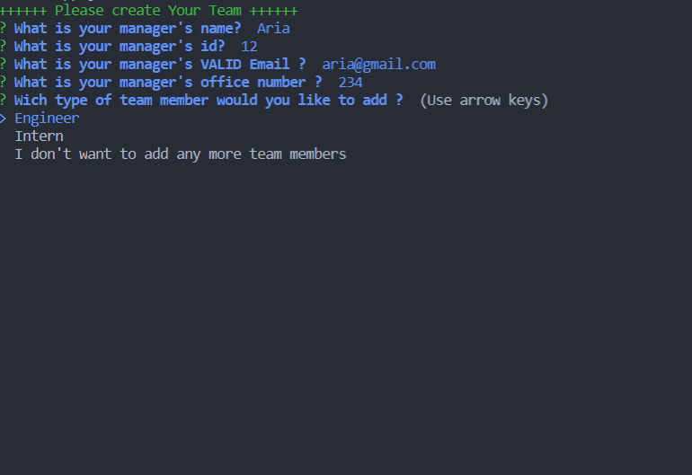
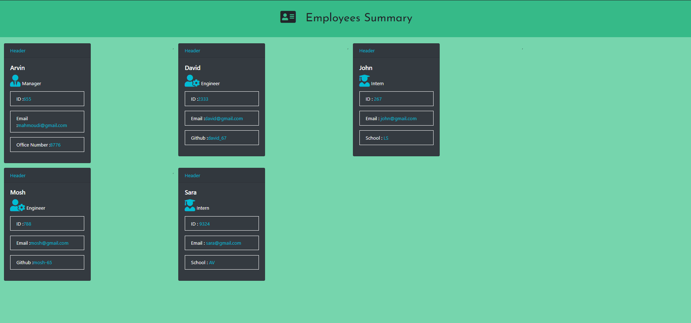

# Template-Engine

* This application is a Node CLI that takes in information about employees and generates an HTML webpage that displays summaries for each person.

*  The application will prompt the user for information about the team manager and then information about the team members.
   The user can input any number of team members, and they may be a mix of engineers and interns.
   When the user has completed building the team, the application will create an HTML file that displays a nicely formatted team roster based on the information provided by the user.

   ## Instalation
   - After you clone the repo run npm i in your terminal
   - You can run the app with `npm run start` as a `node app.js`
   - Also you can run `npm run dev` as a nodemon app.js

   ## Build with

   JavaScript, jQuery ,CSS,HTML ,Node.js , inquirer, ansi-colors ,

## The view of CLI:

## The view of output :

